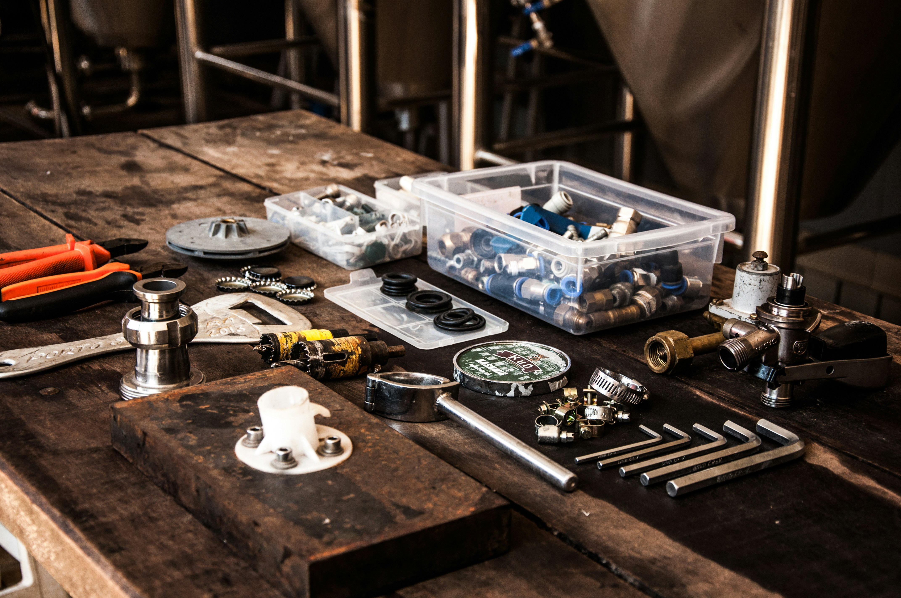

# Affordable Building Maintenance 

###### Created by Damaris Fregoso
 

[Click To View](https://a-b-m-0b4e7891a98d.herokuapp.com/)

## 🖨 Description 
Afforable Building Maintenance is a local and family owned buisness web page.  Where users are able to browse through the companies provided services, previous work gallery, and determine if A.B.M is for them. 

 ## 📸 Screenshots  
  |   Description | Screenshot | 
  |:-------------:| -----------|
  |<h4>Welcome Page (English/Spanish) </h4> |  |
  |<h4>Servuces Page</h4> | |
  |<h4>Our Work Page</h4> | |
  |<h4>Contact Page</h4> | |

## 💻 Technologies Used

 

## 🔗 Links

  
 Trello Board 

  <a href="https://trello.com/b/ZAjajA6y/affordable-building-maintenance"> https://trello.com/b/ZAjajA6y/affordable-building-maintenance </a>

  
 Deployed Link (Heroku) 

  <a href="https://a-b-m-0b4e7891a98d.herokuapp.com/"> https://a-b-m-0b4e7891a98d.herokuapp.com/ </a>

## ⏭️ Next Steps
- [ ] Allow users to create reviews
